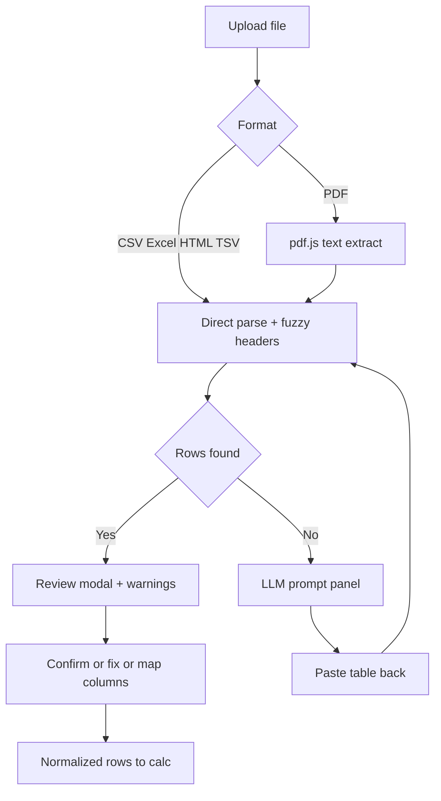

# Ingest UX Overhaul — Unravel Tax

## Guiding principle

Parsing is probabilistic; tax calculation is deterministic. Never block the user before they've seen what was read. No backend, no in-app LLM, no per-broker PDF parsers (all ruled out by `CLAUDE.md` / `BUILD_PLAN.md` Section 9).

## Architecture target

## Sprint 0 — Unblock Stage 4 (no dead-ends)

- Change the ingest return contract in [webapp/src/ingest/parsers.ts](webapp/src/ingest/parsers.ts) and [webapp/src/ingest/types.ts](webapp/src/ingest/types.ts) from `throw | ParsedTransactionSource | PromptRoute` to a single shape carrying `transactions`, `warnings[]`, `headerMap`, and optional `route`. Any recoverable problem (partial headers, some bad rows) yields rows + warnings; only zero-recoverable-rows yields the `PromptRoute`.
- Stop throwing to the upload UI: [webapp/src/components/UploadStep.tsx](webapp/src/components/UploadStep.tsx) `handleFile` opens the review modal whenever rows exist, shows the LLM paste panel when `route` is returned, and only shows an inline error for genuinely unreadable input (e.g. empty file).
- Add `pdfjs-dist` to [webapp/package.json](webapp/package.json). In `parseFile`, for PDFs extract text client-side, then feed it into the existing `parseTextSource` heuristics before falling back to `routePdfOrFreeform()`.
- Universal LLM fallback: CSV/Excel/HTML header failures route to the same paste panel as PDF instead of erroring.
- Single prompt source: import `prompts/01-extract-statement.md` at build time (Vite `?raw`) into `UploadStep`, delete the inline `EXTRACTION_PROMPT` duplicate.

## Sprint 1 — Smarter, transparent mapping

- Add row-level warnings to the review modal (bad/unparseable date, assumed instrument type, low-confidence header map).
- Add a manual column mapper: for unmatched raw columns, a dropdown per canonical column so the user maps names the synonym list missed. Lives in the review modal, reuses `resolveTransactionHeaders` output.
- Add `Buy Price` / `Sell Price` columns to the editable review table in `UploadStep`.
- Expand `parseFixtureDate` in [webapp/src/ingest/normalize.ts](webapp/src/ingest/normalize.ts) to accept `DD/MM/YYYY`, `DD-MM-YYYY`, and Excel serials; flag unparseable rows instead of failing the whole file.
- Harden `parseNumber` to strip currency symbols and surface `"-"`/`"N/A"` as row warnings rather than silent `0`/`NaN`.
- Tighten header pass 2 in [webapp/src/ingest/headerMatching.ts](webapp/src/ingest/headerMatching.ts): require synonym length >= 4 for substring matches to stop `Date`->Purchase Date / `Amount`->Buy Value mis-maps.
- Excel title-row skip in `parseExcelBuffer`: scan first N rows for the best header candidate instead of assuming row 0.

## Sprint 2 — Cleanup + truth

- Remove dead code: `assertTransactionColumns()` in `normalize.ts`, unused `IngestionResult` type in `types.ts`, inline prompt duplicate (done in Sprint 0).
- Merge `parseCsvText` / `parseStructuredText` into one delimited parser.
- Deduplicate `summarizeWithRules` and `checklistGaps` (computed twice per render) in [webapp/src/App.tsx](webapp/src/App.tsx); use `transaction.taxClass === "Intraday"` instead of re-classifying for `hasBusinessIncome`.
- Debounce `saveSession` (~500ms) in `App.tsx` so real broker files don't jank on every keystroke.
- Update stale `README.md` Status + `WORKING_PLAN.md` to reflect partial NRI/single-parent wiring and the ingest UX work.

## Validation

- Extend [webapp/scripts/validate-ingest.ts](webapp/scripts/validate-ingest.ts): existing fuzzy + missing-column fixtures must now yield warnings (not throws); add fixtures for `DD/MM/YYYY` dates, Excel-with-title-row, and a PDF-extracted-text path.
- Run `npm run validate:*` and `npm run build` in `webapp/`.
- Manual smoke: one real-shaped broker CSV with odd headers, one PDF with an embedded table, one PDF with no table — each reaches review modal or LLM panel, never a dead-end.

## Explicitly deferred

In-app LLM/API calls, per-broker PDF parsers, value-shape column guessing, Web Worker ingest, notebook fuzzy-header parity, NRI DTAA / HUF partition / 234C, year-rollover import. The real first-time-user dry run stays a manual step for you (I can't run it).