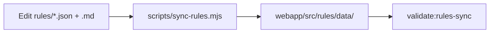

# OSS readiness pack (no rename / no logo change)

## Out of scope (per your request)

- Product name, `LICENSE` copyright line, GitHub org (`kahanikids`), or logo redesign
- Only logo-related change: fix [README.md](README.md) image path to existing [assets/unravel-tax-logo.svg](assets/unravel-tax-logo.svg)

---

## 1. Legal and community files (repo root)

Add three small, plain-language files and link them from README + CONTRIBUTING:

| File                     | Purpose                                                                                                                                                                                                                                                                                                           |
| ------------------------ | ----------------------------------------------------------------------------------------------------------------------------------------------------------------------------------------------------------------------------------------------------------------------------------------------------------------- |
| `**DISCLAIMER.md**`      | Not tax/legal advice; not affiliated with Income Tax Department / CBDT / Ministry of Finance; estimates only; verify on [incometax.gov.in](https://www.incometax.gov.in); MIT “as is”; user bears filing responsibility. Mirror tone of [SYSTEM_SPEC.md §16](SYSTEM_SPEC.md) and peer tools like India Tax Tools. |
| `**CODE_OF_CONDUCT.md**` | Standard [Contributor Covenant v2.1](https://www.contributor-covenant.org/version/2/1/code_of_conduct/) (drop-in, no custom policy).                                                                                                                                                                              |
| `**SECURITY.md**`        | GitHub’s minimal template: report via GitHub Security Advisories or private issue; scope (client-side XSS in ingest/export, dependency issues); what *not* to send (real PAN/filing data).                                                                                                                        |

Update [LICENSE](LICENSE) footer only if needed: add link to `DISCLAIMER.md` alongside existing `SYSTEM_SPEC.md` reference (no copyright text change).

---

## 2. GitHub contribution templates

Create `[.github/ISSUE_TEMPLATE/](.github/ISSUE_TEMPLATE/)` with three YAML forms:

1. `**rule-correction.yml**` — Budget/Finance Act rate or threshold wrong (fields: FY, rule file stem, source link, old vs new value)
2. `**bug-report.yml**` — Calculation, ingest, or export bug (fields: steps, fixture/file type, expected vs actual)
3. `**ux-copy.yml**` — Confusing screen or wording

Add `[.github/pull_request_template.md](.github/pull_request_template.md)` checklist:

- If `rules/` changed: paired `.md` updated, CHANGELOG entry, `npm run sync-rules`, old value searched repo-wide
- If `webapp/` changed: `npm run validate:all` passes

Enable **GitHub Discussions** manually in repo settings (Q&A category) — note in CONTRIBUTING; no code change required.

---

## 3. Rule sync — single source of truth

**Problem:** [rules/*.json](rules/) is duplicated in [webapp/src/rules/data/](webapp/src/rules/data/) with no enforced sync (19 files each today).

**Approach:** Keep copies in git (Vite JSON imports stay unchanged); add automation + CI gate.

**New script:** `[scripts/sync-rules.mjs](scripts/sync-rules.mjs)`

- Copy every `rules/*.json` → `webapp/src/rules/data/<same-name>.json`
- Exit non-zero if counts mismatch (orphan in either dir)
- Idempotent; safe to run locally and in CI

**New npm scripts** in [webapp/package.json](webapp/package.json):

- `sync-rules` — runs the script from repo root
- `validate:rules-sync` — compares file hashes between dirs; fails if out of sync
- `validate:all` — runs existing five validators + `validate:rules-sync`

Wire `sync-rules` into `build` as a pre-step (or document “run before commit when editing rules”) — prefer **explicit** `sync-rules` in CONTRIBUTING + CI fail on drift, not silent auto-commit in CI.

**One-time:** Run sync after adding script to confirm dirs match (should be no-op if already identical).

**Docs:** Update [CONTRIBUTING.md](CONTRIBUTING.md) rule-update steps: step 1.5 = `cd webapp && npm run sync-rules`.

---

## 4. CI validation workflow

**New file:** `[.github/workflows/validate.yml](.github/workflows/validate.yml)`

Triggers: `pull_request` and `push` to `main` when paths touch `rules/**`, `webapp/**`, `scripts/**`, `fixtures/**`.

Steps:

1. Checkout
2. Node 20 + `npm ci` in `webapp/`
3. Python 3 — `python scripts/validate-rule-pairs.py` (root rule pairs)
4. `npm run sync-rules` then `npm run validate:rules-sync`
5. `npm run validate:all`

Keep existing [deploy-pages.yml](.github/workflows/deploy-pages.yml) unchanged; optionally add `validate:all` as a `needs:` job before deploy later (not required for this pass).

---

## 5. README simplification

Restructure [README.md](README.md) without renaming or re-branding:

**Above the fold (~15 lines):**

- Tagline + what it does (organize docs → CA summary + workbook)
- Quick links: Open app | Report issue | Fix a rule | Disclaimer
- One line: not government-affiliated, not tax advice, FY scope
- Fix logo: `assets/unravel-tax-logo.svg`

**Keep but move lower:** design principles, NRI/HUF caveats, detailed Status/milestone notes — link to [BUILD_PLAN.md](BUILD_PLAN.md) / [WORKING_PLAN.md](WORKING_PLAN.md) instead of repeating

**Add short “Maintainer” blurb:** independent OSS project; hosted demo on GitHub Pages; no change to org name

**Add “Other docs” table:** CONTRIBUTING, CHANGELOG, DISCLAIMER, SECURITY, CODE_OF_CONDUCT, BUILD_PLAN (maintainers)

---

## 6. CONTRIBUTING refresh

Rewrite stale section in [CONTRIBUTING.md](CONTRIBUTING.md):

- Remove “webapp not started / don’t work on webapp”
- Add local setup: `cd webapp && npm install && npm run validate:all`
- Add code contribution path: small focused PRs, match existing style
- Add response expectation: rule corrections prioritized; part-time maintenance
- Link issue templates and `DISCLAIMER.md`
- Keep existing Budget rule-update playbook (it’s the best part)

---

## 7. In-app feedback and disclaimer copy

`**[webapp/src/lib/copy.ts](webapp/src/lib/copy.ts)`:**

- Extend `DISCLAIMER_FULL` (and optionally `SCOPE_AND_DISCLAIMER_NOTE`) with government non-affiliation sentence
- Add constant `REPORT_ISSUE_URL` → `https://github.com/kahanikids/unravel-tax/issues/new/choose`

`**[webapp/src/components/HelpPanel.tsx](webapp/src/components/HelpPanel.tsx)`:**

- After disclaimer block: link “Something wrong? Report it on GitHub” (opens in new tab)

`**[webapp/scripts/validate-guided-ui.tsx](webapp/scripts/validate-guided-ui.tsx)`:**

- Assert non-affiliation phrase and report link present when help panel renders

---

## 8. Public roadmap

**New `[ROADMAP.md](ROADMAP.md)`** — extract `status: "planned"` items from `[CAPABILITIES](webapp/src/lib/copy.ts)` into a short public list (advance tax 234C, prior-year import, full NRI/HUF/single-parent calculations). Link from README Contributing section. No new features — documentation only.

---

## 9. Verification before done

- `python scripts/validate-rule-pairs.py`
- `cd webapp && npm run sync-rules && npm run validate:all`
- Read README as a first-time user: one obvious next action remains
- Spot-check Help panel disclaimer + GitHub issue link

---

## File touch summary

| Action    | Files                                                                                                                                                          |
| --------- | -------------------------------------------------------------------------------------------------------------------------------------------------------------- |
| Create    | `DISCLAIMER.md`, `CODE_OF_CONDUCT.md`, `SECURITY.md`, `ROADMAP.md`, `scripts/sync-rules.mjs`, `.github/workflows/validate.yml`, 3 issue templates, PR template |
| Edit      | `README.md`, `CONTRIBUTING.md`, `LICENSE` (link only), `webapp/package.json`, `webapp/src/lib/copy.ts`, `HelpPanel.tsx`, `validate-guided-ui.tsx`              |
| Unchanged | Product name, logo SVG, copyright holder text, GitHub org                                                                                                      |

