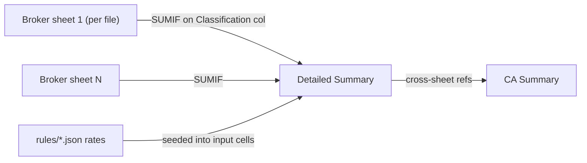

## Goal

Make `webapp` Excel output look and behave like `C:\Dev\Obsidian Vault\Desktop\Personal\India Taxes\RKM\RKM - Capital Gains Workbook.xlsx`: styled tables, live formulas, one broker sheet per uploaded statement. Confirmed scope: data-backed sections only; live formulas with rates seeded from rules JSON.

All output logic lives in one file today: [webapp/src/lib/exports.ts](webapp/src/lib/exports.ts) (currently flat, unstyled, formula-free). The library already installed, `write-excel-file@4.1.1`, supports everything we need (`type: 'Formula'`, `fontWeight`/`fontStyle`/`textColor`/`backgroundColor`/`borderStyle`/`align`/`wrap`/`columnSpan`/`format`, and per-sheet column widths) — no new dependency.

## Reference workbook (what we are copying)

4 sheets: `CA Summary`, `Carry Forward Losses`, `Detailed Summary`, `ABML`. Fully formula-linked: ABML per-row classification/computed-gain -> Detailed Summary SUMIFs -> CA Summary cross-sheet refs.

Style palette (from `xl/styles.xml`), to encode as reusable presets:

- Title: Arial bold 16.
- Subtitle: Arial italic 10.
- Section-header band: Arial bold 12, fill `#D9E1F2` (light blue), left-indented.
- Table header: Arial bold 11 white `#FFFFFF`, fill `#1F4E78` (dark blue), centred, wrapped, thin grey `#BFBFBF` border.
- Data cell: Arial 11, thin grey border.
- Currency: number format `\₹#,##0.00;("₹"#,##0.00);\-`; gains green `#006100`, losses red `#C00000`, plain black; totals bold.
- Input cell (user fills / seeded rate): Arial 11 blue `#0000FF` on yellow `#FFF2CC`; rates use `0.0%` format; dates use `dd-mmm-yyyy`.
- Warning band: bold dark-red on pink `#FCE4EC`.
- Note text: Arial italic 9, wrapped.

## Data mapping

The app already keeps transactions grouped per uploaded file: `documents: DocumentEntry[]` in [webapp/src/App.tsx](webapp/src/App.tsx) (line 67, flattened only at line 155). So "individual broker sheets" = one sheet per `document` (sheet name derived from `fileName`, sanitised to <=31 chars, illegal chars `[]:*?/\` stripped).

Rates come from [webapp/src/rules/data/capital-gains-equity.json](webapp/src/rules/data/capital-gains-equity.json): `ltcg_rate` 0.125, `stcg_rate` 0.2, `ltcg_exemption_inr` 125000, `long_term_holding_period_days_gt` 365, `surcharge_cap_rate` 0.15. Cess (0.04) is not in JSON yet — add `health_education_cess_rate: 0.04` to keep the "no hardcoded rates" rule intact.

## Ingestion change: preserve the broker's own figures

The reference ABML sheet keeps the broker's reported columns (Speculative/ST/LT realised gain, 31-Jan-2018 grandfathering price, LT buy value, taxable gain) and cross-checks them in column R (`Variance vs Broker`). Our normalizer currently drops every column not in the canonical set. `IngestResult` still has `sourceHeaders`/`sourceRecords`/`headerMap` at parse time ([webapp/src/ingest/parsers.ts](webapp/src/ingest/parsers.ts)), but `remapRecordKeys` discards unmapped columns before normalize, and the app's `DocumentEntry` only stores normalized `transactions`.

Surgical fix that needs no component-signature changes (broker figures ride on the transaction objects, so the existing `onCommit`/`documents`/edit flow is untouched):

- [webapp/src/ingest/types.ts](webapp/src/ingest/types.ts): add optional `brokerColumns?: Record<string, string | number>` to `NormalizedTransaction` (the row's source columns that were NOT mapped to a canonical field — i.e. the broker's own gain/grandfathering columns).
- [webapp/src/ingest/parsers.ts](webapp/src/ingest/parsers.ts) `buildIngestResult`: for each record compute the unmapped keys (`sourceHeaders` minus `Object.keys(headerMap)`) and pass them in parallel to normalize.
- [webapp/src/ingest/normalize.ts](webapp/src/ingest/normalize.ts): thread the per-row extras through `normalizeRowsSoft`/`deriveComputedFields` so each successfully derived transaction carries its own `brokerColumns` (kept exactly aligned even when an invalid row is skipped). `deriveComputedFields` already spreads `...fields`, so extras survive in-review row edits ([webapp/src/components/UploadStep.tsx](webapp/src/components/UploadStep.tsx) `updatePendingRow`).

At export time the broker sheet derives its extra-column set from the union of `brokerColumns` keys across a document's transactions (first-seen order), and detects the broker's taxable/realised-gain column by header synonym ("taxable gain", "realised/realized gain", "net gain") to drive the variance formula. No `DocumentEntry`/App-state field is added beyond passing the grouped `documents`.

## Formula / data flow

## Sheet designs

### Broker sheet (one per uploaded document, ABML-style)

Rows 1-2 title/subtitle (merged). Row 4 table header. Data rows 5+. Column layout (one row per transaction, so edits are respected and rows stay aligned):

- Fixed extracted columns A-J: `Scrip Name | Purchase Date | Sell Date | Units | Hold Period (Days) | Buy Value | Sell Value | Buy Price | Sell Price | Instrument Type`.
- Preserved broker columns (K onward, count `n` = size of the document's `brokerColumns` union): the broker's own reported figures copied through verbatim (e.g. Speculative/ST/LT Realised Gain, grandfathering price, LT Buy Value, Taxable Gain).
- Formula columns appended after those: `Classification | Computed Gain | Variance vs Broker | Applicable Tax Treatment | Rule/Law Change Flag`. Their column letters are computed per sheet from `10 + n`.

Cell details (row `r`):
- Dates written as real `Date` values (date format) for display.
- `Classification` FORMULA, referencing the seeded threshold cell on Detailed Summary and matching `classifyTransactionWithRules` exactly (uses the numeric Hold Period col E to avoid date-serial fragility): `=IF(J{r}="debt_mutual_fund","Debt-MF",IF(E{r}=0,"Intraday",IF(E{r}>'Detailed Summary'!$B${ltDaysCell},"LT","ST")))`.
- `Computed Gain` FORMULA `=G{r}-F{r}` (currency; equals `gainLoss` and traceable to the extracted Buy/Sell Value cells).
- `Variance vs Broker` FORMULA `=<computedGainCol>{r}-<brokerTaxableGainCol>{r}` when a broker taxable/realised-gain column is detected among the preserved columns; otherwise blank (`""`). This is the QA cross-check (RKM col R); a non-zero variance flags a mismatch between our computed gain and the broker's reported figure.
- `Applicable Tax Treatment` / `Rule/Law Change Flag` FORMULAs: nested `IF` on the Classification cell producing the section/FA-year text (like ABML cols S/T).

### Detailed Summary

- "By Asset Class & Income Head" table. Every `Gross Gain/(Loss)` cell is a live SUMIF summed across all broker sheets (no pre-computed values) using each sheet's dynamically-resolved Classification and Computed Gain column letters, e.g. STCG = `SUMIF('file1'!$<CL1>$5:$<CL1>$<end>,"ST",'file1'!$<CG1>$5:$<CG1>$<end>)+SUMIF('file2'!...)`; separate rows for Intraday, STCG, LTCG, and `Debt-MF` (so debt is never miscounted into equity buckets).
- "Rate inputs (from rules FY2025-26)" mini-block: LT holding days, STCG rate, LTCG rate, LTCG exemption, surcharge cap, cess — each an input-styled cell seeded from JSON; these are the cells all rate formulas reference.
- Tax-estimate block (data-backed, mirrors RKM rows 37-61): Net/Taxable LTCG (`=MAX(0,LTCG-exemptionCell)`), LTCG loss (`=IF(LTCG<0,-LTCG,0)`), LTCG tax (`=TaxableLTCG*ltcgRateCell`); same for STCG; speculative gain with a user-input slab-rate cell; subtotal, surcharge, cess, estimated total tax.

### CA Summary (in full workbook)

Sectioned, styled like RKM's CA Summary tab. Every capital-gains figure is a cross-sheet FORMULA to Detailed Summary (`='Detailed Summary'!$B$..`) with `Equity Total` `=SUM(...)`, so the whole chain broker sheet -> Detailed Summary -> CA Summary is traceable end-to-end (confirmed: no hardcoded/pre-computed values in summary sheets). Supplemental heads already produced by `caSummaryRows()` (dividends, interest, deductions, carry-forward, ITR form, CA recommendation) render as styled values. No empty placeholder sections (pension, quarterly dividends, MF-detail, STT split are omitted per data_only).

### Standalone CA Summary export

`buildCaSummaryWorkbookExport` restyled to the same visual language (single sheet, values not cross-sheet formulas), so the extracted CA summary is format-consistent. CSV export unchanged.

## Code changes

- [webapp/src/ingest/types.ts](webapp/src/ingest/types.ts): add optional `brokerColumns?: Record<string, string | number>` to `NormalizedTransaction`.
- [webapp/src/ingest/parsers.ts](webapp/src/ingest/parsers.ts): compute each row's unmapped source columns and pass them into normalize.
- [webapp/src/ingest/normalize.ts](webapp/src/ingest/normalize.ts): thread per-row extras through `normalizeRowsSoft`/`deriveComputedFields` so each transaction carries aligned `brokerColumns`.
- [webapp/src/lib/exports.ts](webapp/src/lib/exports.ts): add style presets + number-format constants and small cell-builder helpers at top; rewrite `caSummarySheet`, `transactionsSheet` (-> `brokerSheet(name, txns)` with preserved broker columns + formula columns incl. Variance vs Broker), `detailedSummarySheet` to emit styled `CellObject`s and all-formula summaries; add per-sheet column widths via the `columns` sheet option; change `ExportState` to carry `documents: { name; transactions }[]` and `rateInputs` (rates read from the rule object) instead of a flat `transactions` list; update `buildFullWorkbookExport` to emit `[...brokerSheets, Detailed Summary, CA Summary]`. Drop the unstyled `Checklist State` / `TDS Reconciliation` / `Manifest` sheets (not part of the RKM look; omitted per data_only).
- [webapp/src/App.tsx](webapp/src/App.tsx): pass `documents` (name = `fileName`) and the capital-gains rule values into `buildFullWorkbookExport` (line ~443-452). No change to `commitDocument`/`onCommit` (broker columns ride on the transaction objects).
- [webapp/src/rules/data/capital-gains-equity.json](webapp/src/rules/data/capital-gains-equity.json): add `health_education_cess_rate: 0.04`; update the paired `rules/*.md` "Last verified" + add a `CHANGELOG.md` entry; extend the `CapitalGainsEquityRule` type in `webapp/src/rules` to include the new key.

## Constraints honoured

- Client-side only, no backend. Formulas are deterministic (allowed by CLAUDE.md: "spreadsheet formulas or plain functions"). Rates read from JSON, never hardcoded in logic. Ingestion change is additive (preserves extra source columns; the common normalized row-shape is unchanged for all downstream logic). No real personal data — broker sheet names and preserved columns come from the user's own uploaded statements at runtime; fixtures stay synthetic.

## Verification

- `cd webapp && npm run build` (typecheck) and existing test suite.
- Generate a workbook from the sample/fixture state; open in Excel and confirm: broker sheet formulas compute, Detailed Summary SUMIFs roll up per class, CA Summary cross-refs resolve, styling matches RKM (dark-blue headers, ₹ format, green/red gains, yellow input cells), and editing a seeded rate cell recalculates downstream tax.

