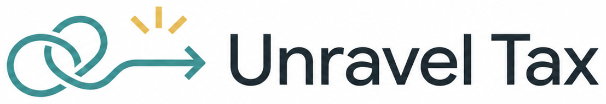

  

<h1 align="center">Unravel Tax</h1>

<strong>Feed it your tax documents in whatever mess they're in, and get back a filing you actually understand.</strong>

  
  
  
  
  

Unravel Tax is a lightweight Indian income tax filing helper that turns
PDFs, Excel files, CSVs, and saved webpages into a clearer checklist,
supported tax calculations, risk flags, a CA Summary, and a full workbook to
keep. It helps taxpayers organize messy statements, spot missing documents,
check AIS and TDS mismatches, compare tax regimes, and hand clean numbers to
a CA, with no signup, no install, no server, and everything staying in your
browser.

**Not tax advice. Not affiliated with the Income Tax Department, CBDT, or
Ministry of Finance.** Built for FY 2025-26 (AY 2026-27). See
[DISCLAIMER.md](DISCLAIMER.md).

**[Open the webapp](https://kahanikids.github.io/unravel-tax/)** ·
[Report an issue](https://github.com/kahanikids/unravel-tax/issues/new/choose) ·
[Fix a rule](CONTRIBUTING.md) ·
[Disclaimer](DISCLAIMER.md)

---

## Contents

- [Start here](#start-here)
- [How it works](#how-it-works)
- [Profiles](#profiles-nri-huf-senior-citizens-single-parents)
- [Got feedback, a question, or found something wrong?](#got-feedback-a-question-or-found-something-wrong)
- [Contributing](#contributing)
- [Maintainer](#maintainer)
- [Status](#status)
- [Other docs](#other-docs)

---

## Start here

**[Open the webapp](https://kahanikids.github.io/unravel-tax/)**: no install,
no signup. Everything happens in your browser.

**Manual path (no browser app):** copy
[prompts/00-master-guide.md](prompts/00-master-guide.md) into an AI chat and
use the Excel workbook in `templates/excel-export/UnravelTax-Template.xlsx`.
The Google Sheets master link is not published yet.

**Run locally:** clone this repo, then `cd webapp`, `npm install`, `npm run dev`.

That's the whole journey. The sections below are background.

---

## How it works

- **Infer, don't interrogate.** Plain-language questions once; the tool works
  out which checklist and forms apply.
- **Spreadsheet engine, chat guide.** Arithmetic is deterministic. AI only reads
  messy documents and explains results; it never does the maths.
- **Consequences before numbers.** Missing items and risk flags come before totals.
- **Simple by default.** Full detail is one click away, never the starting view.
- **Your file is the record.** No account, no server. Export the workbook and keep it.

## Profiles (NRI, HUF, senior citizens, single parents)

The webapp orients each profile and builds the right checklist. NRE exempt
interest and minor's-income clubbing are partially calculated; full NRI/HUF
paths remain deferred. The app says so in the final "Before you export" check.
See
[ROADMAP.md](ROADMAP.md) and `rules/` for profile-specific rules.

---

## Got feedback, a question, or found something wrong?

You don't need to know Git, or how GitHub Discussions work, to talk to us.

**[Open a new issue](https://github.com/kahanikids/unravel-tax/issues/new/choose)**,
pick whichever option sounds closest to what happened, and describe it in
your own words: "this number looked wrong," "I got stuck on this screen,"
"can you support X." That's the whole process. Someone will read it and
reply; you don't need to format anything or tag anyone.

If it's a security issue (something that could expose someone's data),
please don't post it publicly. See [SECURITY.md](SECURITY.md) instead.

---

## Contributing

Rule updates after each Union Budget are the highest-value contribution.
See [CONTRIBUTING.md](CONTRIBUTING.md) and [ROADMAP.md](ROADMAP.md).

---

## Maintainer

Independent open source project. The hosted demo on GitHub Pages
([kahanikids.github.io/unravel-tax](https://kahanikids.github.io/unravel-tax/))
tracks `main`. Maintained part-time; rule corrections are prioritised over
new features.

---

## Status

Milestones 1–4 are built. The webapp validator suite runs through
`npm run validate:all`, and the same validators can run under Vitest with
`npm run test` or `npm run test:coverage`. "Built" means the code passes
checks, not that every profile is fully calculated yet. Highlights:

- Hosted free on GitHub Pages; redeploys on push to `main` when `webapp/` changes
- Resident + senior-citizen calculations from `rules/*.json`
- Partial NRI/single-parent numbers; HUF regime comparison explicitly skipped
- CSV, Excel, saved-webpage, structured-text, and guided PDF/free-text ingestion
- Editable extraction review, fuzzy header matching, summary-only JSON guidance, and local-folder save on supported Chromium browsers
- CA Summary CSV/XLSX plus full workbook export, generated entirely in the browser
- AIS/Form 26AS/TDS reconciliation, old-vs-new regime comparison with break-even, loan deduction inputs, partial 234B interest estimate, and year-over-year dashboard

---

## Other docs

| Doc | For |
|-----|-----|
| [CONTRIBUTING.md](CONTRIBUTING.md) | How to submit rule fixes and code |
| [CHANGELOG.md](CHANGELOG.md) | Dated rule and project changes |
| [DISCLAIMER.md](DISCLAIMER.md) | Legal scope and non-affiliation |
| [SECURITY.md](SECURITY.md) | Reporting vulnerabilities |
| [CODE_OF_CONDUCT.md](CODE_OF_CONDUCT.md) | Community standards |
| [ROADMAP.md](ROADMAP.md) | Planned features |

## License

MIT. See [LICENSE](LICENSE). Fork and adapt freely; keep the copyright notice.
Not tax or legal advice. See [DISCLAIMER.md](DISCLAIMER.md).
